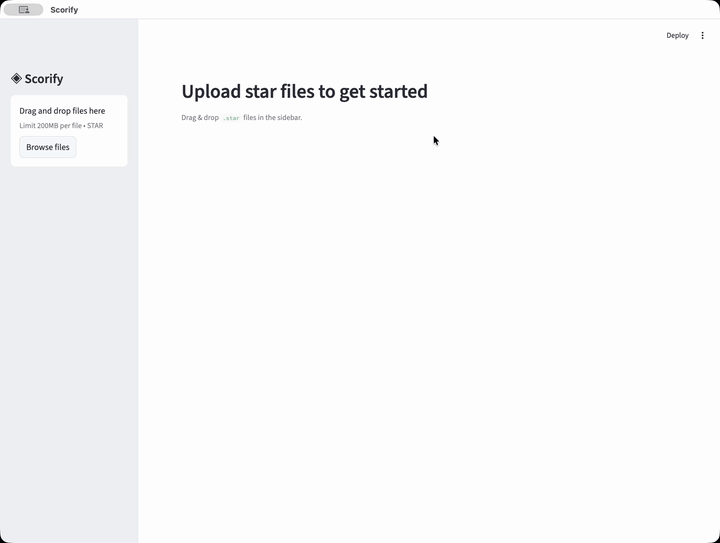

# Scorify

Interactive analysis of cryo-ET template matching results.

<p align="center">
  
</p>

**[Try it online](https://scorify.streamlit.app)**

## Why

Template matching in cryo-ET produces thousands of candidate particles spread across many tomograms. Evaluating these results — deciding on score thresholds, checking for preferred orientations, comparing tomograms — typically means writing one-off scripts or juggling command-line tools.

Scorify gives you an interactive dashboard for this. Upload `.star` files from any template matching pipeline, set a score cutoff, and immediately see how it affects your data. When you're done, export the filtered particles back`.

## Run locally

```bash
pip install scorify
scorify &
```

This launches the app, which you can access at `http://localhost:8501/`.

## Features

- Per-tomogram score distributions, particle counts, and summary statistics
- Euler angle analysis with orientation heatmaps
- 3D spatial particle viewer
- Threshold explorer to evaluate score cutoffs
- Export filtered particles as `.star` (single or per-tomogram)

--

## Disclaimer

Scorify is still in early development.